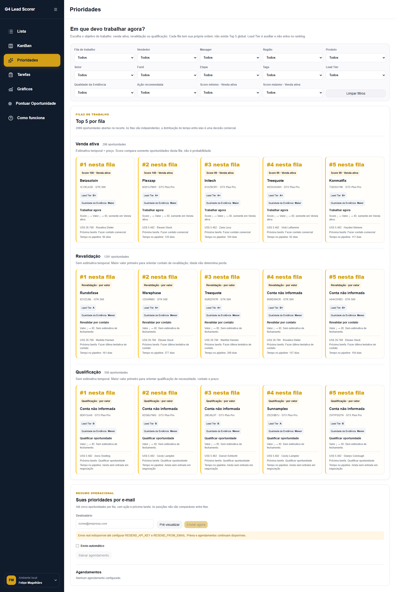
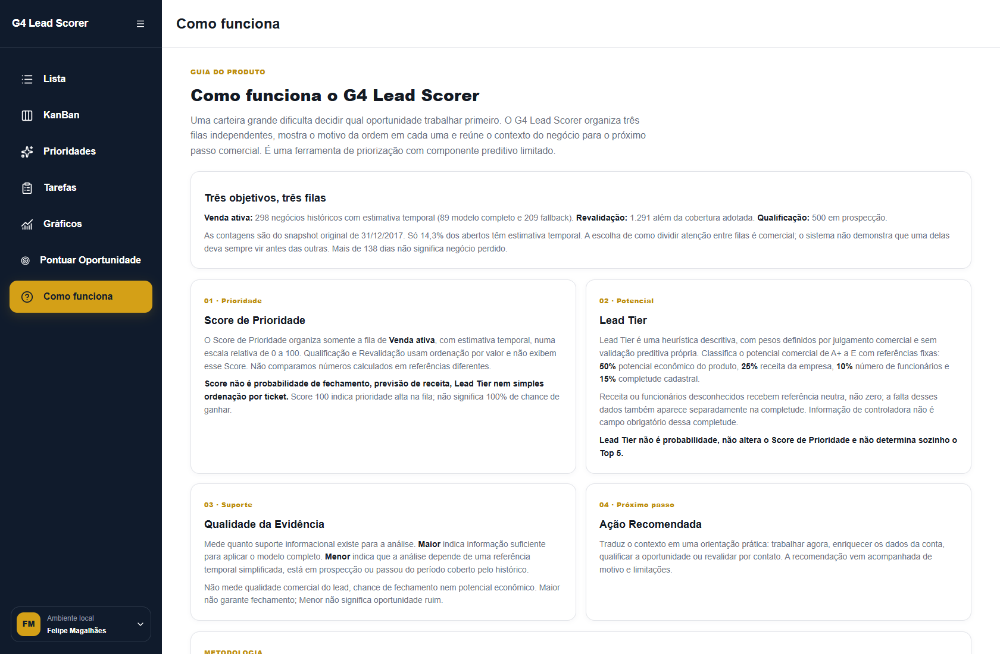

# Submissão — Felipe de Magalhães Alves — Challenge 003

## 🎥 Vídeo de autoapresentação e processo — 5min30s

**[Assistir ao vídeo de Felipe Magalhães](https://drive.google.com/file/d/1mfyoNHScu6HYp3WF1wsjYBnji3n4bIrQ/view)**

Recomenda-se assistir ao vídeo para complementar a avaliação de como Felipe realizou o processo de construção desta solução, em conjunto com o [Process Log](process-log/PROCESS_LOG.md).

**Comece por aqui:** [Rodar a aplicação](#executar-e-verificar) · [Exemplo prático com três oportunidades reais](docs/OPERATIONAL_WALKTHROUGH.md) · [Benchmark por corte](docs/BENCHMARK_REPRODUCIBLE.md#estabilidade-nos-seis-cortes).

Este README descreve a versão atual com três filas independentes. O [relato autoral da entrega inicial](README_ENTREGA_INICIAL.md) permanece integralmente disponível como histórico, incluindo as capturas e os resultados reportados à época.

## Sobre mim

- **Nome:** Felipe de Magalhães Alves, 31 anos.
- **LinkedIn:** https://www.linkedin.com/in/felipemagalves/
- **Challenge escolhido:** 003 — Lead Scorer.

Sou especialista em Receitas e Inteligência Artificial, com atuação em gestão de processos, pessoas e eficiência operacional. Hoje mapeio e atendo empresas que precisam estruturar suas operações, aumentar performance e ganhar eficiência. Sou recorrentemente convidado pelo G4 para participar dos programas Sprint de Aumento de Receitas e Inteligência Artificial, apoiando empresários e gestores no direcionamento e estruturação de suas operações e empresas.

## Executive Summary

O G4 Lead Scorer é uma aplicação local para organizar o trabalho sobre 2.089 oportunidades abertas, com dados reais do challenge, explicação e próximo passo comercial. A carteira é separada em Venda ativa (298), Revalidação (1.291) e Qualificação (500), cada uma com sua própria ordem e até cinco destaques; não existe Top 5 global. Somente Venda ativa tem Score de Prioridade baseado em estimativa temporal, que não é probabilidade de fechamento; as demais filas ordenam por valor, sem inventar propensão. O novo benchmark é reproduzível e mostra vantagem agregada do modelo/fallback sobre preço simples, porém discriminação fraca e perdas em três dos seis cortes. A recomendação é usar as filas como apoio operacional com decisão humana, mantendo explícito que a superioridade comercial ainda precisa de validação prospectiva.

## Solução

A [aplicação autocontida em `solution/`](solution/) reúne Lista, Kanban, workspace, tarefas, tags, anotações, filtros por vendedor/gestor/região, simulação e cadastro, Prioridades, Dashboard e digest por e-mail. CSVs e artefatos estão incluídos; SQLite é inicializado localmente. O [protótipo anterior](process-log/prototype/source/) é evidência de exploração e validação, separado da solução oficial.

### Abordagem

O ponto de partida foi distinguir volume de ganhos, taxa de conversão e valor econômico. O pipeline foi unido a produtos, contas e equipe pelas chaves do dataset; `GTXPro` é normalizado para `GTX Pro`. O snapshot é **31/12/2017**: 8.800 oportunidades, sendo 2.089 abertas e 6.711 encerradas. Valores de produto e negócio permanecem em USD; receita das contas é informada em milhões de USD.

O artefato do modelo usa **nove cortes mensais** de março a novembro de 2017, alvo de vitória nos 30 dias seguintes e oito variáveis de tempo, produto e conta. Resultado final, valor fechado, vendedor, gestor e região não são features. Ausência de conta leva a fallback temporal; mais de 138 dias e prospecção sem entrada em negociação não recebem propensão temporal. Os detalhes de joins, features, referências e risco residual de leakage estão na [metodologia](docs/METHODOLOGY.md).

| Fila | Base / abertos no snapshot | Ordem dentro da fila | Próximo passo |
| --- | --- | --- | --- |
| Venda ativa | `MODEL_FULL`: 89; `AGE_ONLY_FALLBACK`: 209 | Score DESC → Valor exibido DESC → ID | Contato comercial ou enriquecimento de conta |
| Revalidação | `OUT_OF_COVERAGE_VALUE`: 1.291 | Valor exibido DESC → ID | Revalidar interesse; idade não determina perda |
| Qualificação | `PROSPECTING_VALUE`: 500 | Valor exibido DESC → ID | Qualificar necessidade, contato e prazo |

**Score não é probabilidade.** Em Venda ativa, ele é a posição relativa de propensão histórica × preço do produto na referência congelada. Modelo e fallback compartilham o alvo temporal e a referência; a calibração comparativa não é presumida. Revalidação e Qualificação não exibem esse Score. Os percentis econômicos antigos ficam apenas no contrato interno para compatibilidade histórica.

**Lead Tier** é uma heurística comercial separada de A+ a E; não altera o Score nem o ranking. **Qualidade da Evidência** descreve suporte informacional, não chance de ganho. Somente 298/2.089 abertos têm estimativa temporal (14,3%), dos quais 89 usam o modelo completo (4,3%). A escolha de quanto tempo dedicar a cada fila continua com o vendedor e a gestão.

### Resultados / Findings

**Operação demonstrável:** Lista, Kanban, Prioridades, Tarefas, Dashboard e digest usam filas identificadas. Ganhos e perdidos continuam visíveis em Finalização conforme o filtro de Status. O [roteiro de uso](docs/OPERATIONAL_WALKTHROUGH.md) demonstra como selecionar vendedor, interpretar três casos reais e organizar tarefas e anotações.



Captura da versão com filas independentes: a posição reinicia em cada grupo; somente Venda ativa mostra Score. Não há comparação numérica entre as três filas.



Trecho inicial do guia atual, com cobertura, Score, Lead Tier, evidência e ação. As capturas da entrega inicial continuam no registro histórico.

**Benchmark reproduzível:** seis avaliações mensais, treino somente com janelas de rótulo já encerradas e Top 5 por vendedor no mesmo universo elegível para A/B/C/D. Esses seis cortes de avaliação são distintos dos nove cortes usados pelo artefato final. Script, resultados e IDs selecionados estão incluídos.

| Método | Ganhos selecionados | Valor histórico dos ganhos (USD) | AUC média |
| --- | ---: | ---: | ---: |
| A — preço | 165 | 969.188 | — |
| B — idade × preço | 137 | 747.394 | — |
| C — fallback temporal × preço | 172 | 951.180 | 0,542 |
| D — modelo/fallback × preço | 198 | 1.077.539 | 0,541 |

**D supera A em três cortes e perde em três.** A AUC média de 0,541 indica discriminação fraca. A vantagem agregada não demonstra ganho causal, significância estatística ou resultado futuro. Veja a [tabela dos seis cortes e o protocolo completo](docs/BENCHMARK_REPRODUCIBLE.md#estabilidade-nos-seis-cortes). Este experimento é novo; os números do benchmark antigo permanecem apenas no histórico, sem alegação de reprodução.

**Engenharia verificada:** oito suítes de domínio/integração, lint/build em Windows e Linux, inicialização limpa de SQLite, ausência de credenciais Resend e fingerprint compatível com LF/CRLF. A paridade **2.089/2.089** comprova consistência de implementação, não eficácia comercial. O [registro de validação](docs/POST_REVIEW_VALIDATION.md) delimita o que foi executado; não houve envio real de e-mail.

### Executar e verificar

Requer **Node.js 24 ou superior** e npm. A partir da raiz deste repositório:

```bash
cd submissions/felipe-magalhaes/solution
npm ci
npm run dev
```

Abra **http://localhost:3000**. O SQLite é criado automaticamente; não é necessário um banco prévio nem credenciais para as funções principais. [Siga o exemplo prático](docs/OPERATIONAL_WALKTHROUGH.md) para explorar as três filas com um vendedor real.

O [README técnico](solution/README.md) detalha testes, produção local, `.env.example`, `ARENA_DB_PATH`, Resend opcional e o worker separado (`npm run email:worker`). Sem credenciais Resend, a prévia funciona e o envio fica desabilitado. Python é opcional, necessário apenas para regenerar o artefato ou reproduzir o benchmark.

### Recomendações

1. Usar as filas conforme o objetivo do trabalho: avançar negociações, revalidar contexto ou qualificar oportunidades. Conferir explicação, evidência e tarefa antes de agir.
2. Registrar atividades e próximos passos para reduzir oportunidades sem acompanhamento; revalidar negócios antigos sem presumir que estejam perdidos.
3. Antes de adotar o modelo como recomendação de produção, comparar prospectivamente com preço simples e coletar dados cadastrais datados, atividades, custo e margem. O [caminho para produção](docs/PRODUCTION_PATH.md) descreve evoluções necessárias.

### Limitações

O componente preditivo é experimental e cobre uma parcela pequena da carteira aberta. Firmografia em snapshot, oportunidades repetidas entre cortes e escolhas feitas após conhecer o dataset limitam a avaliação retrospectiva. Não há validação da melhor divisão de esforço entre filas, de calibração ou do efeito de contatar um negócio. SQLite é local, não há autenticação/multiempresa real e o envio Resend não foi validado em produção. [Limitações completas](docs/LIMITATIONS.md).

## Process Log — Como usei IA

100% do código foi gerado por IA. Não escrevi manualmente nenhuma linha de código. Defini o problema, hipóteses, critérios, lógica comercial, arquitetura, UX e decisões finais. O budget oficial do desafio é 4–6 horas. Foram aproximadamente 6 horas de trabalho efetivo, distribuídas em sessões e excluindo pausas e períodos sem execução, como horário comercial/durante meu trabalho. É uma estimativa de tempo útil, não o intervalo de calendário, não houve cronometragem contínua.

**Escopo da estimativa:** o parágrafo autoral acima se refere à entrega inicial. As revisões posteriores estão identificadas no Process Log e não foram incorporadas à estimativa de aproximadamente seis horas; não houve cronometragem contínua dessas rodadas.

### Ferramentas usadas

| Ferramenta | Uso no processo |
| --- | --- |
| Sam Agent (Hermes) | Análise, modelagem e contexto do benchmark histórico. |
| Claude | Challenger de hipóteses e alternativas. |
| Astra | Auditoria e reprodução independente de casos operacionais. |
| ChatGPT | Síntese, cross-audit, decisões metodológicas e arquitetura do produto. |
| Codex | Implementação do código, verificações e ajustes da solução final. |

### Workflow

1. Exploração dos dados e questionamento das hipóteses de priorização, com distinção entre taxas, volumes e preço.
2. Protótipo funcional para testar scoring, explicabilidade e operação; portabilidade do motor para a solução final com fixture de paridade.
3. Implementação e uso do CRM local, seguidos de auditorias e correções operacionais.
4. Revisão externa da fila única: separação em três filas e inclusão de benchmark reproduzível com resultados mais modestos que os anteriormente reportados.
5. Organização da entrega atual e das evidências históricas, preservando o relato autoral. A [cronologia detalhada](process-log/PROCESS_LOG.md) registra decisões, correções e limites.

### Onde a IA errou e como corrigi

As primeiras auditorias identificaram falhas de desempate, sincronização de funil, simulação/cadastro e reabertura. A revisão posterior encontrou um erro de decisão que a paridade não detectava: percentis econômicos e Scores temporais competiam no mesmo Top 5. Felipe interrompeu novas funcionalidades, trouxe os pareceres e autorizou corrigir a coerência operacional. O ranking agora separa as filas; o resultado fraco do novo benchmark foi mantido e explicitado. As [evidências e decisões](process-log/PROCESS_LOG.md#7-revisão-externa-e-correção-de-coerência--26092026) distinguem julgamento humano e implementação com IA.

### O que eu adicionei que a IA sozinha não faria

O [relato autoral original](README_ENTREGA_INICIAL.md#o-que-eu-adicionei-que-a-ia-sozinha-não-faria) e as [conversas registradas](process-log/PROCESS_LOG.md#evidências-visuais) mostram Felipe questionando conclusões, distinguindo potencial de probabilidade e exigindo tratamento explícito para dados ausentes e falta de cobertura temporal. A decisão de suspender expansão de funcionalidades e rever a promessa central também está registrada. As evidências permitem avaliar esse julgamento sem atribuir à IA as decisões humanas.

## Evidências

- [x] Screenshots das conversas com IA
- [ ] Screen recording do workflow
- [ ] Chat exports
- [x] Git history (se construiu código)
- [x] Outro: vídeo de autoapresentação + Process Log detalhado + protótipo funcional de validação + artefatos e scripts de verificação

O vídeo de autoapresentação está destacado no início; não é classificado aqui como gravação de tela do workflow sem verificação desse conteúdo.

- [Process Log detalhado](process-log/PROCESS_LOG.md), [registros brutos](process-log/raw/) e [histórico original de commits](process-log/COMMIT_HISTORY_RAW.md).
- [Relato integral da entrega inicial](README_ENTREGA_INICIAL.md), com texto autoral e capturas preservados; [inventário das fontes](docs/INVENTORY_RAW.md).
- [Protótipo funcional de validação](process-log/prototype/source/), incluído apenas como evidência do processo.
- [Artefato de scoring](solution/src/domain/scoring/model-artifact.json), [fixture](solution/scripts/scoring/fixtures/legacy-snapshot.json), [scripts](solution/scripts/) e [benchmark por corte](docs/BENCHMARK_REPRODUCIBLE.md).

**Submissão enviada em:** 25/09/2026
