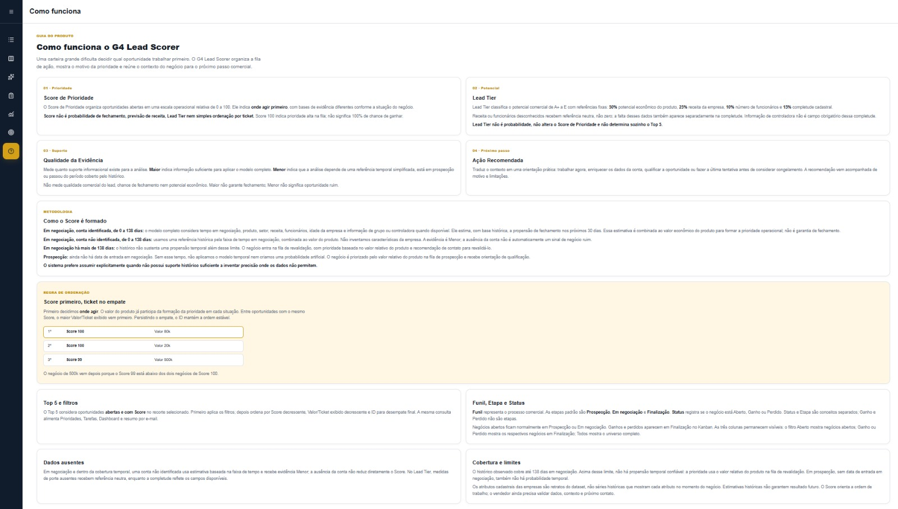
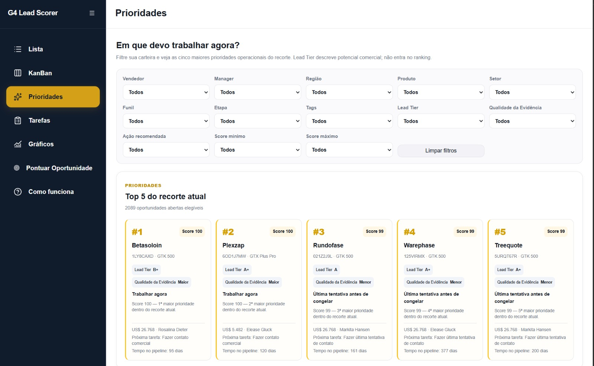

# Submissão — Felipe de Magalhães Alves — Challenge 003

## Sobre mim

- **Nome:** Felipe de Magalhães Alves, 31 anos.
- **LinkedIn:** https://www.linkedin.com/in/felipemagalves/
- **Challenge escolhido:** 003 — Lead Scorer.

Sou especialista em Receitas e Inteligência Artificial, com atuação em gestão de processos, pessoas e eficiência operacional. Hoje mapeio e atendo empresas que precisam estruturar suas operações, aumentar performance e ganhar eficiência. Sou recorrentemente convidado pelo G4 para participar dos programas Sprint de Aumento de Receitas e Inteligência Artificial, apoiando empresários e gestores no direcionamento e estruturação de suas operações e empresas.

## Executive Summary

Construí o G4 Lead Scorer, uma aplicação local que transforma os negócios históricos em uma fila explicável para trabalhar os 2.089 negócios ainda abertos. A análise separou 298 negócios com suporte para estimativa temporal de 30 dias, 1.291 em negociação além da cobertura histórica e 500 em prospecção sem data de entrada em negociação. Para cada oportunidade aberta, o produto mostra Score de Prioridade, base, qualidade da evidência, ação e motivo; o Score é prioridade relativa como sugerido pelo desafio, não probabilidade de fechamento. O benchmark histórico reportado favoreceu modelo com fallback (método D), mas seus scripts originais não acompanham esta entrega. A evidência executável aqui é a paridade do motor final em 2.089/2.089 oportunidades. Recomendo usar a fila para orientar contato e qualificação, mantendo validação humana e recalibrando o modelo com novos dados operacionais mais completos enquanto usam em produção.

## Solução

A entrega principal é a [aplicação autocontida](solution/) "G4 Lead Scorer", com dados, código, scripts, artefato congelado, dependências e instruções de execução. O projeto `G4-003` anterior foi apenas um protótipo funcional de validação de hipóteses de scoring, explicabilidade e UX. Seu [código está incluído como evidência do processo](process-log/prototype/source/), separado da solução final. O protótipo foi tratado como ferramenta de pensamento, não como entrega final.

### Abordagem

Parti dos cinco CSVs do challenge, então a partir das colunas, criei uma hipótese lógica para padronização de pontos para priorizar leads que se destaquem nos que já foram ganhos, e para contra-trabalhar com os perdidos, e isto me levou para outros lugares. O pipeline foi unido a produtos pelo nome do produto, a contas pelo nome da conta e à equipe pelo vendedor. A grafia `GTXPro` é normalizada em memória para `GTX Pro`. `accounts.revenue` está em milhões de USD; preços e valores de negócio permanecem em USD. O snapshot operacional é **31/12/2017**. Dos 8.800 negócios, 500 estão em Prospecting, 1.589 em Engaging, 4.238 Won e 2.473 Lost. Os 2.089 primeiros são os abertos priorizados.

Contagens, taxas e valor agregado respondem perguntas diferentes. Nos CSVs, **GTX Basic** tem 915 ganhos em 1.436 negócios encerrados (63,7%), enquanto **GTX Plus Pro** tem 479 em 745 (64,3%): mais ganhos absolutos não implicam maior taxa. Receita histórica total mistura volume, preço e resultado; não equivale à propensão individual de ganhar em 30 dias. Esses números são descritivos, não teste prospectivo.

Quatro hipóteses de priorização constam do handoff histórico: **A**, preço puro; **B**, idade em negociação × preço; **C**, propensão por faixa de idade × preço; **D**, regressão logística com fallback por faixa × preço. A ignora o timing e as características disponíveis; B usa antiguidade como peso mecânico, embora um negócio antigo não seja automaticamente ruim; C usa o tempo, mas não todo o contexto de produto e conta. A lógica D foi escolhida **onde havia suporte temporal**. Não se extrapolou sua propensão para negócios acima de 138 dias nem para Prospecting. A falta de conta também não virou penalidade automática.

O modelo coberto usa **nove cortes mensais** completos de março a novembro de 2017 e alvo de **vitória nos 30 dias seguintes** para oportunidades ativas em cada corte. São 10.589 linhas de treino, com regressão logística L2 e oito variáveis: dias em negociação, faixa de dias, produto, setor, receita da conta, funcionários, idade da empresa e indicador de subsidiária. Fechamento, valor fechado, vendedor, gestor e região não são variáveis preditivas. O artefato versionado congela transformações, coeficientes, taxas de fallback e distribuições de referência. [Detalhes metodológicos](docs/METHODOLOGY.md).

| Situação da oportunidade aberta | Base do Score | Regra | Evidência / ação |
| --- | --- | --- | --- |
| Engaging, 0–138 dias, conta identificada: **89** | `MODEL_FULL` | Propensão histórica estimada × preço sugerido do produto | Maior / trabalhar agora |
| Engaging, 0–138 dias, sem conta identificada: **209** | `AGE_ONLY_FALLBACK` | Taxa suavizada da faixa de tempo × preço, sem inventar atributos da empresa | Menor / enriquecer conta |
| Engaging, mais de 138 dias: **1.291** | `OUT_OF_COVERAGE_VALUE` | Preço relativo na fila de revalidação, sem propensão temporal | Menor / revalidar por contato |
| Prospecting, sem `engage_date`: **500** | `PROSPECTING_VALUE` | Preço relativo na fila de qualificação, sem propensão temporal | Menor / qualificar |

Para as duas primeiras linhas, `priorityValue = propensity30d × salesPrice`; nas outras, o preço é a medida econômica relativa. Cada base usa a distribuição congelada pertinente para gerar **Score de Prioridade de 0 a 100**. Somente 298/2.089 abertos recebem estimativa temporal. Os Scores organizam o trabalho, mas as quatro bases têm suportes diferentes e não devem ser confundidas com probabilidades calibradas entre grupos. A **Ação Recomendada** traduz a situação em próximo passo; **Qualidade da Evidência** indica suporte informacional, não qualidade comercial do lead.

**Lead Tier** é uma classificação comercial separada, de A+ a E: 50% percentil fixo do preço do produto, 25% receita da empresa, 10% funcionários e 15% completude de seis campos. Receita ou funcionários ausentes recebem referência neutra de 0,50 e sua ausência aparece separadamente na completude. Tier não altera o Score e não determina sozinho o Top 5. A ordem operacional da Lista, do Kanban e do Top 5 é **Score DESC → Valor exibido DESC → ID**. Exemplo: Score 100/80k, Score 100/20k, Score 99/500k. Primeiro decidimos onde agir; entre prioridades iguais, vem o maior impacto econômico. O ticket participa do cálculo onde aplicável e desempata a ordenação final, mas não substitui a prioridade de ação.

### Resultados / Findings

O handoff da análise anterior reporta o seguinte **benchmark de seis cortes, Top 5 por vendedor**:

| Método | Ganhos capturados | Receita capturada | Participação reportada | Retenção reportada |
| --- | ---: | ---: | ---: | ---: |
| A — preço | 165 | US$ 969.188 | 24,8% | 86,1% |
| B — idade × preço | 179 | US$ 1.021.014 | 26,1% | 52,8% |
| C — faixa temporal × preço | 216 | US$ 1.169.680 | 29,9% | 45,1% |
| D — modelo/fallback × preço | 255 | US$ 1.347.335 | 34,5% | 57,1% |

O mesmo handoff reporta AUC média **0,622 para C** e **0,658 para D**. **Os scripts e outputs originais desse benchmark não foram disponibilizados nesta entrega; esses resultados não foram reexecutados aqui.** A implementação final reproduz o motor do protótipo por fixture exportada: `npm run verify:scoring` verifica **2.089/2.089** negócios abertos, quatro casos novos e campos de Score, base, evidência, ação e sinais. É paridade de implementação, não validação prospectiva nem promessa de receita.

O produto inclui Lista, Kanban com Finalização para ganhos e perdidos, workspace único, tarefas, tags, anotações, filtros, simulação e cadastro, Top 5 dinâmico, Dashboard e resumo por e-mail. O mesmo ranking alimenta Prioridades, Tarefas, Dashboard e digest. O SQLite guarda o estado operacional local; os CSVs não são sobrescritos. O envio real usa Resend apenas quando há credenciais e disparo explícito ou worker; não foi validado em produção. [Código e arquitetura](solution/README.md) · [Limitações detalhadas](docs/LIMITATIONS.md).



G4 Lead Scorer — tela de explicabilidade, mostrando como Score, Lead Tier, Qualidade da Evidência, cobertura temporal e regras operacionais devem ser interpretados.



G4 Lead Scorer — fila operacional de prioridades, combinando Score de Prioridade, Lead Tier, Ação Recomendada e impacto econômico.

### Executar e verificar

Requer **Node.js 24 ou superior**. Na pasta `solution/`:

```bash
npm ci
npm run dev
```

Abra `http://localhost:3000`. O banco local `data/arena-operations.sqlite` é criado automaticamente e não é versionado; `ARENA_DB_PATH` permite escolher outro caminho. O `.env.example` lista `RESEND_API_KEY` e `RESEND_FROM_EMAIL`; configure `.env.local` somente se quiser testar envio real com remetente autorizado. O agendamento usa um processo separado (`npm run email:worker`); sem credenciais, não envia. A inferência web usa TypeScript e o artefato já incluído; Python só é necessário para regenerá-lo.

Verificações disponíveis em `solution/`: `npm run verify:data`, `verify:scoring`, `verify:operations`, `verify:priorities`, `verify:dashboard`, `verify:email`, `verify:product:model`, `verify:product:ux`, `lint` e `build`. O [README técnico da aplicação](solution/README.md) detalha os comandos e a estrutura da solução.

### Recomendações

1. Usar Score, evidência e ação juntos para organizar a rotina comercial, validar dados e contexto antes de contatar.
2. Separar a fila de revalidação de negócios acima de 138 dias e a qualificação de Prospecting. Não atribuir a esses grupos uma probabilidade temporal fictícia, talvez ações para descontinuar com menos insistência a partir de agora para os que passaram "do prazo", e tentar nutrir automaticamente ao longo do tempo, sem dedicar prioridade humana.
3. Recolher histórico de atividades, dados cadastrais datados e custos/margens antes de recalibrar e comparar desempenho prospectivo, somando isso a busca por mais informações que melhorem a chegada ao decisor, como nomes, telefones, cargos, padrão de empresa que compra e outras informações de qualificação que a empresa possa utilizar para entender o perfil de consumo.
4. Para uso compartilhado, seguir o [caminho para produção](docs/PRODUCTION_PATH.md): banco transacional, identidade, isolamento entre empresas, integração CRM, scheduler e observabilidade.

### Limitações

Os atributos de empresa são snapshots do dataset, não séries históricas no momento de cada corte, isso cria risco de vazamento retrospectivo. Não há margem ou custo, nem histórico completo de atividades comerciais. O horizonte observado de negócios encerrados vai até 138 dias, e Prospecting não tem "engage_date". O benchmark A/B/C/D é reportado por fonte anterior, sem os scripts originais para reprodução nesta entrega. SQLite é local; Resend não foi validado em produção. Score e Lead Tier não são probabilidades. [Inventário por categoria](docs/LIMITATIONS.md).

## Process Log — Como usei IA

100% do código foi gerado por IA. Não escrevi manualmente nenhuma linha de código. Defini o problema, hipóteses, critérios, lógica comercial, arquitetura, UX e decisões finais. O budget oficial do desafio é 4–6 horas. Foram aproximadamente 6 horas de trabalho efetivo, distribuídas em sessões e excluindo pausas e períodos sem execução, como horário comercial/durante meu trabalho. É uma estimativa de tempo útil, não o intervalo de calendário, não houve cronometragem contínua.

### Ferramentas usadas

| Ferramenta | Uso no processo |
| --- | --- |
| Sam Agent (Hermes) | Análise, modelagem e contexto do benchmark histórico. |
| Claude | Challenger de hipóteses e alternativas. |
| Astra | Auditoria e reprodução independente de casos operacionais. |
| ChatGPT | Síntese, cross-audit, decisões metodológicas e arquitetura do produto. |
| Codex | Implementação do código, verificações e ajustes da solução final. |

### Workflow

1. Defini o problema de priorização e examinei dados, etapas, datas e variáveis disponíveis. Com IA, confrontei contagens mais massivas, como as de ganhos, taxas, valor e limites temporais.
2. Comparei as hipóteses A/B/C/D reportadas no handoff; separei propensão, prioridade econômica, evidência e próximo passo. Usei o protótipo funcional para validar lógica e UX, sem tratá-lo como entrega principal.
3. Dirigi a implementação do motor final, do CRM local também baseado em outros que já criei no passado, do Top 5, do Dashboard e do digest. A IA gerou o código; eu defini comportamento e critérios de aceite.
4. Usei o produto, ajustei Lista, Kanban, etapas, filtros e workspace, e submeti os fluxos a auditoria independente. Corrigi os achados operacionais reproduzidos e congelei o produto no commit "7f3d349".
5. Organizei solução, fontes, histórico e documentação para avaliação. A [cronologia detalhada](process-log/PROCESS_LOG.md) distingue evidências executadas, resultados apenas reportados e decisões comerciais.

### Onde a IA errou e como corrigi

A auditoria reproduziu quatro falhas operacionais: desempate econômico ausente na ordenação manual por Score; seleção de funil e filtro de funil divergentes; diferença entre Score simulado e Score salvo para os mesmos dados; e reabertura de negócio sem sincronização completa de tags/tarefa inicial. Corrigi esses caminhos e acrescentei verificações dirigidas. Depois, a inspeção do Kanban mostrou que negócios ganhos e perdidos pareciam sumir do pipeline; a coluna fixa Finalização e o filtro de Status tornaram o universo visível. Não alterei a fórmula histórica do Score nem o artefato por causa desses ajustes.

### O que eu adicionei que a IA sozinha não faria

Defini a prioridade como decisão de onde agir, antes do desempate por valor. Distingui o potencial comercial do Tier e o suporte da evidência da chance de ganho. Insisti em não punir automaticamente conta ausente, não declarar negócio antigo automaticamente ruim e não inventar propensão fora da cobertura. O uso real do produto motivou a separação entre Status e Etapa, a Finalização visível e a consistência entre Lista, Kanban e Top 5.

## Evidências

- [x] Screenshots das conversas com IA
- [ ] Screen recording do workflow
- [ ] Chat exports
- [x] Git history (se construiu código)
- [x] Outro: Process Log detalhado + protótipo funcional de validação + artefatos e scripts de verificação

- [Histórico bruto de commits](process-log/COMMIT_HISTORY_RAW.md) e [Process Log detalhado](process-log/PROCESS_LOG.md).
- [Registros originais dos blocos](process-log/raw/) e [inventário técnico das fontes](docs/INVENTORY_RAW.md).
- [Artefato de scoring](solution/src/domain/scoring/model-artifact.json), [fixture de paridade](solution/scripts/scoring/fixtures/legacy-snapshot.json) e [scripts de verificação](solution/scripts/).
- [Código do protótipo funcional de validação](process-log/prototype/source/), incluído apenas como evidência do processo. As [capturas de conversas e telas](process-log/PROCESS_LOG.md#evidências-visuais) estão incluídas no Process Log; gravação e exports não foram incluídos nesta rodada.

**Submissão enviada em:** 25/09/2026
